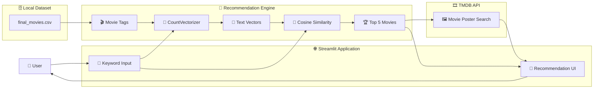

# 🎬 Movie Recommendation System

<p align="center">
  
  
  
  
</p>

<p align="center">
  <strong>🎥 Discover movies based on keywords, genres, moods and themes.</strong>
</p>

<p align="center">
  A lightweight content-based recommendation system built with Python, Streamlit and NLP-based text similarity.
</p>

---

## 🧭 Overview

The **Movie Recommendation System** is a content-based movie recommendation application that allows users to enter keywords such as:

```text
love
romance
thriller
ghost
action
```

The system analyzes the movie metadata stored in the dataset, converts textual tags into numerical vectors using **CountVectorizer**, calculates similarity using **cosine similarity**, and returns the most relevant movies.

The application also integrates the **TMDB API** to dynamically retrieve movie posters for the recommended titles.

---

## 🎯 Problem Statement

With thousands of movies available across different genres and themes, users can find it difficult to discover movies that match a specific mood or interest.

Traditional browsing requires users to manually search through large collections.

This project explores a simple content-based recommendation approach where users can describe what they are looking for using keywords, and the system retrieves movies with similar textual characteristics.

---

## 💡 Solution

The application follows a simple recommendation pipeline:

```text
User Keyword
     │
     ▼
Movie Tags
     │
     ▼
CountVectorizer
     │
     ▼
Text Vectors
     │
     ▼
Cosine Similarity
     │
     ▼
Top 5 Movies
     │
     ▼
TMDB Poster API
     │
     ▼
Streamlit Interface
```

---

# ✨ Key Features

### 🔎 Keyword-Based Recommendations

Enter a keyword or phrase describing the type of movie you want.

Examples:

```text
love
romance
ghost
thriller
```

---

### 🧠 Content-Based Filtering

The system recommends movies based on the similarity between the user's keyword and movie metadata.

It does not depend on user ratings or collaborative filtering.

---

### 📝 Text Vectorization

Movie tags are converted into numerical representations using:

**CountVectorizer**

The implementation limits the vocabulary to a maximum of **5,000 features** and uses English stop-word removal.

---

### 📐 Cosine Similarity

Cosine similarity is used to compare the keyword vector against the movie vectors.

The movies with the highest similarity scores are selected as recommendations.

---

### 🍿 Top 5 Recommendations

The application returns the five movies with the highest similarity scores for the entered keyword.

---

### 🎞️ Dynamic Movie Posters

Recommended movie titles are sent to the **TMDB API** to retrieve poster images dynamically.

If a poster cannot be found, the application displays a placeholder image.

---

### ⚡ Streamlit Interface

The project uses Streamlit to provide an interactive web interface with:

- Keyword input
- Recommendation button
- Movie poster cards
- Movie titles
- Responsive five-column layout

---

# 🏗️ System Architecture



---

# 🔬 How the Recommendation System Works

## 1. Data Loading

The application loads the preprocessed movie dataset:

```text
final_movies.csv
```

The dataset contains movie information including the movie title and a processed `tags` field used by the recommendation engine.

The dataset is loaded using Pandas.

---

## 2. Text Processing

The movie `tags` column is processed using:

```python
CountVectorizer(
    max_features=5000,
    stop_words="english"
)
```

This converts the textual movie information into numerical vectors.

---

## 3. Similarity Calculation

The application uses:

```python
cosine_similarity()
```

to measure how closely the user's keyword matches the movie vectors.

The similarity scores are then sorted to identify the most relevant movies.

---

## 4. Recommendation Selection

The system selects the top five movies:

```python
indices = scores.argsort()[-n:][::-1]
```

The resulting movie titles are displayed in the Streamlit interface.

---

## 5. Poster Retrieval

For each recommended movie, the application queries the TMDB API.

The workflow is:

```text
Movie Title
     │
     ▼
TMDB Search API
     │
     ▼
Poster Path
     │
     ▼
TMDB Image URL
     │
     ▼
Streamlit Movie Card
```

---

# 🛠️ Technology Stack

| Category | Technology |
|---|---|
| Programming Language | Python |
| Web Framework | Streamlit |
| Data Processing | Pandas, NumPy |
| NLP / Vectorization | CountVectorizer |
| Similarity | Cosine Similarity |
| Machine Learning | Scikit-learn |
| Movie Data | CSV Dataset |
| Movie Posters | TMDB API |
| HTTP Requests | Requests |
| Styling | Custom CSS |
| Version Control | Git / GitHub |

---

# 📂 Project Structure

```text
movie-recommendation-system/
│
├── app.py
│
├── final_movies.csv
│
├── requirements.txt
│
├── styles/
│   └── style.css
│
├── README.md
│
└── LICENSE
```

---

# ⚙️ Application Components

## `app.py`

The main Streamlit application.

Responsible for:

- Loading the dataset
- Building the recommendation model
- Processing user keywords
- Calculating similarity
- Selecting recommendations
- Fetching TMDB posters
- Rendering the user interface

---

## `final_movies.csv`

Preprocessed movie dataset used by the recommendation engine.

The application reads this dataset using:

```python
pd.read_csv("final_movies.csv")
```

---

## `styles/style.css`

Contains custom styling used to improve the appearance of the Streamlit application.

---

## `requirements.txt`

Contains the Python dependencies required to run the application.

```text
streamlit
pandas
numpy
scikit-learn
requests
```

---

# 🚀 Getting Started

## 1. Clone the Repository

```bash
git clone https://github.com/meganathm123-lgtm/movie-recommendation-system.git
```

```bash
cd movie-recommendation-system
```

---

## 2. Create a Virtual Environment

### Windows

```bash
python -m venv venv
```

```bash
venv\Scripts\activate
```

### Linux / macOS

```bash
python3 -m venv venv
```

```bash
source venv/bin/activate
```

---

## 3. Install Dependencies

```bash
pip install -r requirements.txt
```

---

# 🔐 Configure TMDB API

The application reads the TMDB API key using Streamlit Secrets:

```python
API_KEY = st.secrets["TMDB_API_KEY"]
```

Create the following file:

```text
.streamlit/secrets.toml
```

Add:

```toml
TMDB_API_KEY = "your_api_key_here"
```

> 🔒 Do not commit your actual API key to GitHub.

---

# ▶️ Run the Application

Start Streamlit with:

```bash
streamlit run app.py
```

The application will open in your browser through the local Streamlit server.

---

# ☁️ Deployment

The application is designed to work with **Streamlit Cloud**.

For deployment:

1. Push the repository to GitHub.
2. Create a Streamlit Cloud application.
3. Select the repository.
4. Set `app.py` as the application entry point.
5. Add the TMDB API key through Streamlit Secrets.
6. Deploy the application.

---

# 🔐 API Key Security

The TMDB API key is **not hardcoded** into the source code.

The application accesses it through:

```python
st.secrets["TMDB_API_KEY"]
```

This allows the key to be stored separately from the public repository.

---

# 🎨 User Interface

The application provides a simple workflow:

```text
┌─────────────────────────────┐
│ 🎬 Movie Recommendation     │
│                             │
│ Enter keyword               │
│ ┌─────────────────────────┐ │
│ │ love / thriller / ...   │ │
│ └─────────────────────────┘ │
│                             │
│       [ Recommend ]         │
└──────────────┬──────────────┘
               │
               ▼
┌─────────────────────────────┐
│ 🍿 Recommended Movies       │
│                             │
│  Movie 1  Movie 2  Movie 3  │
│  Movie 4  Movie 5            │
│                             │
│  🎞️       🎞️       🎞️      │
│  🎞️       🎞️                │
└─────────────────────────────┘
```

---

# 🧪 Recommendation Example

### Input

```text
thriller
```

### Processing

```text
"thriller"
     │
     ▼
CountVectorizer
     │
     ▼
Keyword Vector
     │
     ▼
Cosine Similarity
     │
     ▼
Movie Similarity Scores
     │
     ▼
Top 5 Movies
```

### Output

The application displays the five highest-ranked matching movie titles together with their TMDB posters when available.

---

# 📊 Recommendation Method

The current implementation uses **content-based filtering**.

### Formula

Cosine similarity measures the angle between two vectors:

```text
cosine similarity =
(A · B) / (||A|| × ||B||)
```

A higher similarity indicates that the keyword vector and movie representation are more similar.

---

# ⚡ Performance Considerations

The application uses Streamlit caching for:

- Dataset loading
- Model construction
- TMDB poster requests

This helps avoid repeatedly performing the same expensive operations during Streamlit reruns.

The recommendation engine builds:

```text
CountVectorizer
      +
Movie Vectors
      +
Cosine Similarity
```

and reuses the cached results.

---

# 🔮 Future Improvements

Potential future improvements include:

- Movie overview and ratings
- Genre-based filtering
- TF-IDF vectorization
- Improved recommendation ranking
- User-based collaborative filtering
- More advanced recommendation models
- Improved UI animations
- Additional movie metadata
- Personalized recommendation profiles

---

# 📌 Current Limitations

The current system is intentionally lightweight and keyword-driven.

Recommendations depend on the textual information contained in the movie dataset.

The current implementation does not include:

- User accounts
- User rating history
- Collaborative filtering
- Personalized user profiles
- Deep learning recommendation models

These can be explored in future versions.

---

# 🎓 Learning Outcomes

This project demonstrates practical implementation of:

```text
Python
        ↓
Data Processing
        ↓
Natural Language Processing
        ↓
Text Vectorization
        ↓
Similarity Analysis
        ↓
Recommendation System
        ↓
API Integration
        ↓
Interactive Web Application
        ↓
Cloud Deployment
```

---

# 🧠 Concepts Demonstrated

- Content-Based Recommendation
- Natural Language Processing
- Count Vectorization
- Cosine Similarity
- Data Processing
- API Integration
- Streamlit Application Development
- Caching
- Secure Secret Management
- Cloud Deployment

---

# 🌐 External Service

Movie poster information is retrieved from:

**TMDB — The Movie Database**

The application uses TMDB search and image services to retrieve poster artwork for recommended movie titles.

---

# 👨‍💻 Author

<p align="center">

<strong>Meganath M</strong>

<br>

CSE — Artificial Intelligence & Machine Learning

<br><br>

<a href="https://github.com/meganathm123-lgtm">
  
</a>

</p>

---

# 📄 License

This project is licensed under the **MIT License**.

---

<p align="center">

<strong>🎬 Movie Recommendation System</strong>

<br><br>

<em>
Discover movies through keywords, similarity and content-based recommendations.
</em>

<br><br>

⭐ If you find this project interesting, consider starring the repository.

</p>
